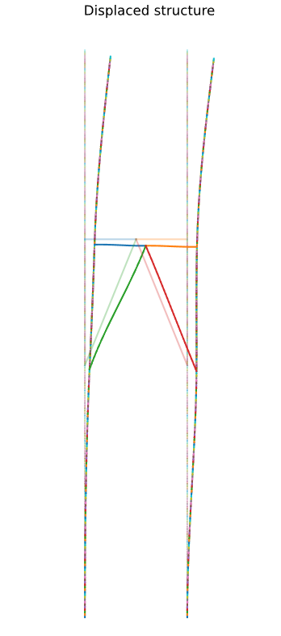
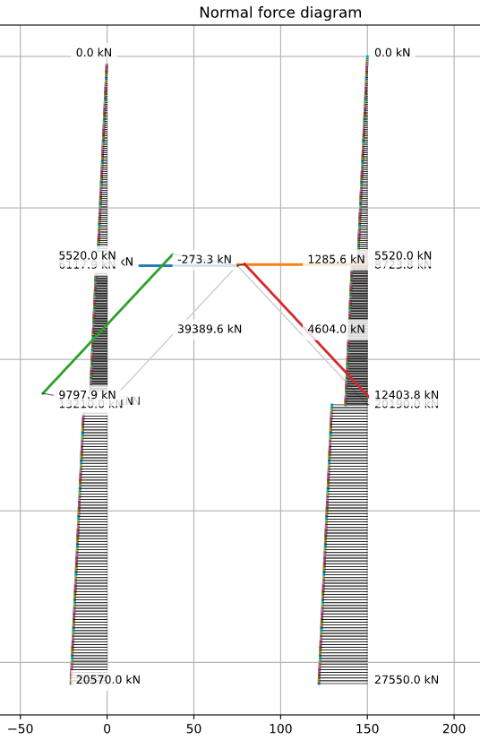
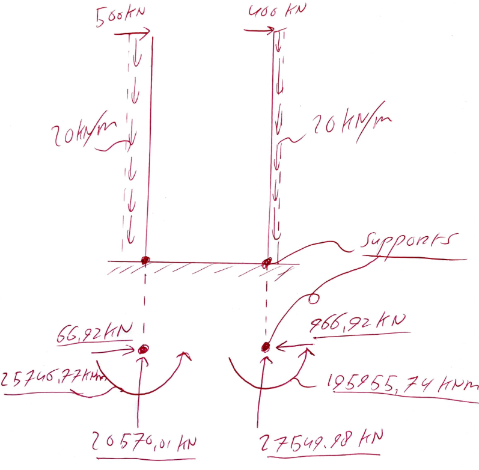
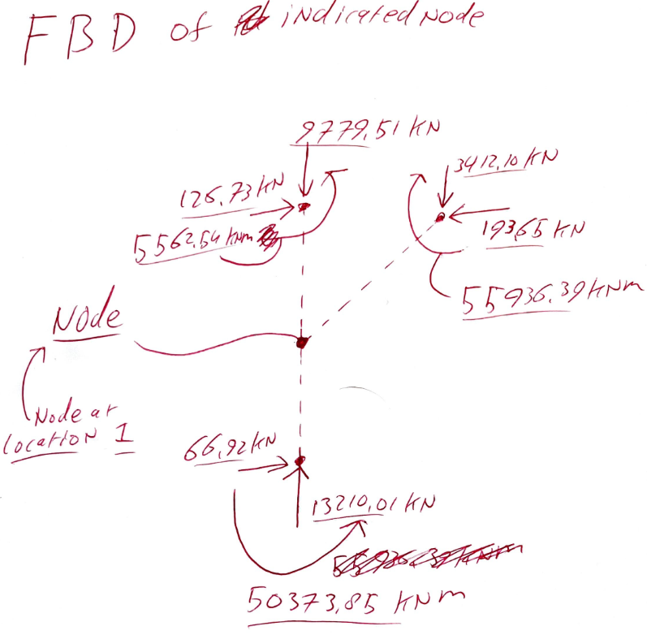

## 1. Explain in words and math how you adapted/added code and/or procedures to solve this structure.

### Structural characteristics
The structure is modeled as a 2D frame composed of two towers, a bridge, and two diagonal members. All members are represented by beam-column elements, meaning both axial deformation and bending deformation are included. Each node has three degrees of freedom:

- horizontal displacement  
- vertical displacement  
- rotation  

### Geometry
The total tower height is:

H = 828 m  

Key elevations along the towers:

- base: x = 0 m  
- lower connection: x = 368 m  
- bridge level: x = 552 m  
- top: x = 828 m  

Horizontal positions:

- left tower: y = 0 m  
- bridge midpoint: y = 75 m  
- right tower: y = 150 m  

The bridge connects the towers at x = 552 m and is split into two elements via a midpoint node. Two diagonal members connect the lower tower nodes (x = 368 m) to this midpoint.

### Variable tower stiffness
The tower stiffness varies with height:

EI(x) = 4000 · exp(−x / 828)   [GN·m²]  
EA(x) = 13 · exp(−x / 828)     [GN]  

These are converted for consistent units:

- EI → kN·m²  
- EA → kN  

### Discretization of towers
Because stiffness varies continuously, each tower is divided into many small elements.

The tower is split into three segments:
1. base → lower node  
2. lower node → bridge node  
3. bridge node → top  

Each segment is discretized into:

n = 100 sub-elements  

So per tower:
- 3 × 100 = 300 elements  
- total (both towers) = 600 elements  

For each sub-element, stiffness is evaluated at the midpoint:

x_mid = (x₁ + x₂) / 2  

and assigned as constant:

    xmid = 0.5 * (xa + xb)
    e.set_section({
        'EI': EI_tower(xmid),
        'EA': EA_tower(xmid)
    })

This results in a piecewise-constant approximation of the continuous stiffness variation.

---

### Bridge and diagonal members
The bridge and diagonals have constant properties:

EI = 4000 GN·m²  
EA = 13 GN  

The bridge is modeled with two elements (left and right halves), and each diagonal is modeled with one element.

#### Distributed loads
- Towers: q = −20 kN/m  
- Bridge: q = 100 kN/m  

#### Point loads
Horizontal loads at tower tops:

- left top: 400 kN  
- right top: 500 kN  

### Boundary conditions
Both tower bases are fully fixed:

- ux = 0  
- uy = 0  
- rotation = 0  

### Solution procedure

The global system is assembled:

K · u = F  

After applying boundary conditions:

K_ff · u_f = F_f  

Solved using:

    u = np.linalg.solve(Kff, Ff)

Full displacement vector is reconstructed and support reactions are computed.

## 2. Make a table of all nodal displacement and show the displaced structure in a figure. Indicate how you identify nodes.
Nodes are values with the blue dots, elements are values in the squares, and if an element is discretized it is stated in red.  

  

    
  

 
 
    
| Node | ux [m] | uy [m] | rz [rad] |
|:-----|:-------|:-------|:---------|
| 0 | 0.000000 | 0.000000 | 0.000000 |
| 1 | 0.682678 | 0.592339 | -0.004514 |
| 2 | 1.416309 | 0.787373 | -0.003096 |
| 3 | 3.757605 | 0.915317 | -0.011412 |
| 4 | 0.000000 | 0.000000 | 0.000000 |
| 5 | 1.348573 | 0.841131 | -0.000569 |
| 6 | 1.422150 | 1.100582 | -0.002223 |
| 7 | 3.894262 | 1.228526 | -0.012619 |
| 8 | 1.414733 | 0.944089 | -0.001822 |

The ux is positive to the right →  
And the uy is positive downwards!

 
 
 

  

    
  

## 3. Show the normal force diagram of the structure in a figure.

  

    
  

 
Normal force values shown in the plot: 

Bridge members: 
bridge left    :  -273.26 kN 
bridge right   :  1285.63 kN 
diag left      : 39389.57 kN 
diag right     :  4604.02 kN 
 
Tower elements (discretized) (bottom / top): 
left tower: base -> low       : bottom = 20570.02 kN | top = 13210.02 kN 
left tower: low -> bridge     : bottom =  9797.91 kN | top =  6117.91 kN 
left tower: bridge -> top     : bottom =  5520.00 kN | top =     0.00 kN 
right tower: base -> low      : bottom = 27549.98 kN | top = 20189.98 kN 
right tower: low -> bridge    : bottom = 12403.82 kN | top =  8723.82 kN 
right tower: bridge -> top    : bottom =  5520.00 kN | top =     0.00 kN  

## 4. Provide a figure of a free body diagram of the full structure in which you show all the forces working on the structure (including support reactions) with numerical values from your code. This specific figure can be hand drawn.

  

    
  

## 5. Provide a figure of a free body diagram of the indicated node with numerical values from your code. This specific figure can be hand drawn.

  

    
  

