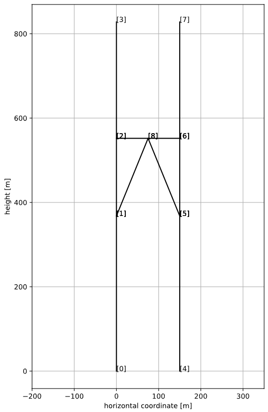
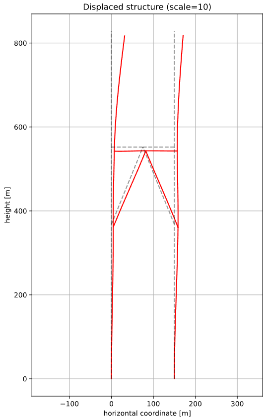
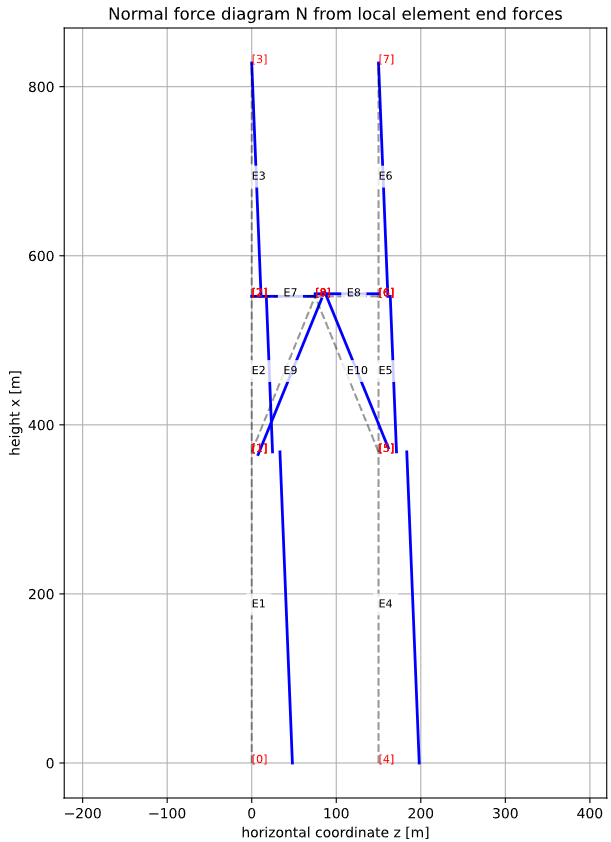
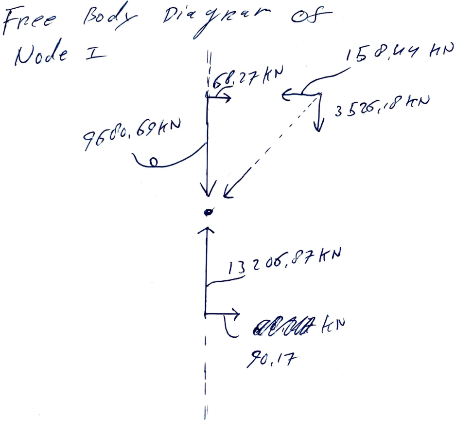

## 1. Explain in words and math how you adapted/added code and/or procedures to solve this structure.

### Structural characteristics
The structure is modeled as a 2D frame composed of two towers, a bridge, and two diagonal members. All members are represented by beam-column elements, meaning both axial deformation and bending deformation are included. Each node has three degrees of freedom:

- horizontal displacement  
- vertical displacement  
- rotation  


### Geometry
The total tower height is:

H = 828 m  

Key elevations along the towers:

- base: x = 0 m  
- lower connection: x = 368 m  
- bridge level: x = 552 m  
- top: x = 828 m  

Horizontal positions:

- left tower: y = 0 m  
- bridge midpoint: y = 75 m  
- right tower: y = 150 m  

The bridge connects the towers at x = 552 m and is split into two elements via a midpoint node. Two diagonal members connect the lower tower nodes (x = 368 m) to this midpoint.

### Variable tower stiffness

The tower stiffness decreases exponentially with height:

$$
EA(x)=13e^{-x/828}
\qquad [\text{GN}]
$$

$$
EI(x)=4000e^{-x/828}
\qquad [\text{GNm}^2]
$$

The properties are converted to consistent units:

$$
1 \ \text{GN}=10^6 \ \text{kN}
$$

$$
1 \ \text{GNm}^2=10^6 \ \text{kNm}^2
$$

resulting in:

$$
EA(0)=13\times10^6 \ \text{kN}
$$

$$
EI(0)=4000\times10^6 \ \text{kNm}^2
$$

Since the tower stiffness varies continuously, a custom element stiffness matrix was implemented for the tower elements.

The axial contribution is obtained from:

$$
K_a=
\int_0^L
EA(x_a+s)
B_a^TB_a
\,ds
$$

where

$$
B_a=
\begin{bmatrix}
-\frac{1}{L} & 0 & 0 &
\frac{1}{L} & 0 & 0
\end{bmatrix}
$$

The required integral is:

$$
A_0=
\int_0^L
EA(x_a+s)\,ds
$$

The bending contribution is:

$$
K_b=
\int_0^L
EI(x_a+s)
B_b^TB_b
\,ds
$$

The curvature-displacement matrix is written as:

$$
B_b=c_0+c_1s
$$

which leads to three analytical integrals:

$$
B_0=
\int_0^L EI(x_a+s)\,ds
$$

$$
B_1=
\int_0^L EI(x_a+s)s\,ds
$$

$$
B_2=
\int_0^L EI(x_a+s)s^2\,ds
$$

The complete tower stiffness matrix is then:

$$
K_{tower}=K_a+K_b
$$

This stiffness matrix is evaluated using exact closed-form expressions implemented in the functions:

```python
exp_integrals(...)
tower_stiffness_closed_form(...)
```

---

### Bridge and diagonal members
The bridge and diagonals have constant properties:

EI = 4000 GN·m²  
EA = 13 GN  

The bridge is modeled with two elements (left and right halves), and each diagonal is modeled with one element.


#### Distributed loads
- Towers: q = −20 kN/m  
- Bridge: q = 100 kN/m  

#### Point loads
Horizontal loads at tower tops:

- left top: 400 kN  
- right top: 500 kN  

### Boundary conditions
Both tower bases are fully fixed:

- ux = 0  
- uy = 0  
- rotation = 0  

### Solution procedure

The global system is assembled:

K · u = F  

After applying boundary conditions:

K_ff · u_f = F_f  

Solved using:

    u = np.linalg.solve(Kff, Ff)

Full displacement vector is reconstructed and support reactions are computed.

## 2. Make a table of all nodal displacement and show the displaced structure in a figure. Indicate how you identify nodes.
Nodes are values with the blue dots, elements are values in the squares, and if an element is discretized it is stated in red. <br>

<div style="text-align: center;">
  <div style="background-color: white; display: inline-block; padding: 10px;">
    
  </div>
</div>


<br>
<br>
    
| Node | x [m] | z [m] | u_x [m] | u_z [m] | φ [rad] |
|------|------:|------:|--------:|--------:|---------:|
| 0 | 0.0 | 0.0 | 0.000000 | 0.000000 | 0.000000 |
| 1 | 368.0 | 0.0 | -0.714289 | 0.420675 | -0.000421 |
| 2 | 552.0 | 0.0 | -0.971975 | 0.686968 | 0.002197 |
| 3 | 828.0 | 0.0 | -1.106183 | 3.148790 | 0.012595 |
| 4 | 0.0 | 150.0 | 0.000000 | 0.000000 | 0.000000 |
| 5 | 368.0 | 150.0 | -0.714868 | 0.864697 | 0.001216 |
| 6 | 552.0 | 150.0 | -0.931098 | 0.695732 | -0.000360 |
| 7 | 828.0 | 150.0 | -1.065306 | 2.080504 | 0.007958 |
| 8 | 552.0 | 75.0 | -0.890527 | 0.686946 | -0.000176 |


<p style="text-align: center;">
The ux is positive to the right → <br>
And the uy is positive downwards!
</p>
<br>
<br>
<br>

<div style="text-align: center;">
  <div style="background-color: white; display: inline-block; padding: 10px;">
    
  </div>
</div>


## 3. Show the normal force diagram of the structure in a figure.

<div style="text-align: center;">
  <div style="background-color: white; display: inline-block; padding: 10px;">
    
  </div>
</div>
<br>
Normal force values shown in the plot:<br>

| Node | Connected to Node | Element | Normal Force N [kN] |
|------|------------------:|--------:|--------------------:|
| 0 | 1 | 1 | 24051.74 (outer end)|
| 1 | 0 | 1 | 16691.74 |
| 1 | 2 | 2 | 12307.30 |
| 1 | 8 | 9 | 4101.87 |
| 2 | 1 | 2 | 8627.30 |
| 2 | 3 | 3 | 5520.00 |
| 2 | 8 | 7 | 3.86 |
| 3 | 2 | 3 | 0.00 (outer end)|
| 4 | 5 | 4 | 24068.26 (outer end)|
| 5 | 4 | 4 | 16708.26 |
| 5 | 6 | 5 | 10623.33 |
| 5 | 8 | 10 | 6252.84 |
| 6 | 5 | 5 | 6943.33 |
| 6 | 7 | 6 | 5520.00 |
| 6 | 8 | 8 | -1522.85 |
| 7 | 6 | 6 | -0.00 (outer end)|
| 8 | 1 | 9 | 4101.87 |
| 8 | 2 | 7 | 3.86 |
| 8 | 5 | 10 | 6252.84 |
| 8 | 6 | 8 | -1522.85 |


## 4. Provide a figure of a free body diagram of the full structure in which you show all the forces working on the structure (including support reactions) with numerical values from your code. This specific figure can be hand drawn.

<div style="text-align: center;">
  <div style="background-color: white; display: inline-block; padding: 10px;">
    
  </div>
</div>

## 5. Provide a figure of a free body diagram of the indicated node with numerical values from your code. This specific figure can be hand drawn.

<div style="text-align: center;">
  <div style="background-color: white; display: inline-block; padding: 10px;">
    
  </div>
</div>